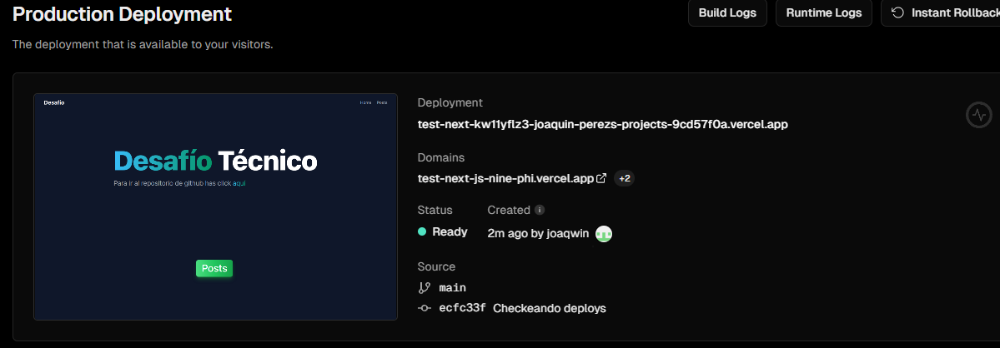

# Desafío Técnico.

Deploy en Vercel: https://test-next-js-nine-phi.vercel.app/

Deploy en CloudFront: http://nextjs-deploy-desafio.s3-website-us-east-1.amazonaws.com/

(El link del Deploy de CloudFront aún no está pronto debido a unos problemas con la verificación de mi cuenta de AWS. Apenas resuelva este problema, el link será actualizado. Por lo pronto, aparece el link del sitio web estático alojado en el bucket de S3)

## Step 1

Para crear la aplicación usando NextJS ejecuté el siguiente comando: 

```bash
npx create-next-app@latest
```

Para que la creación sea exitosa es necesario tener una versión de Node ≥ 18.7.

## Step 2

Creé mi cuenta de Vercel, lo instalé en mi GitHub e importé el proyecto que había creado. Luego de importarlo, fue sencillo deployearlo.



En este paso se requería que se hicieran deploys automáticos cuando se realizaba un push a la main branch y cada vez que se hacía un pull request. Por suerte, esta configuración venía por default y solo tuve que comprobar que se hiciera correctamente en cada caso.

## Step 3

Para crear la página /posts creé una carpeta con el mismo nombre en /app y dentro creé un archivo page.tsx.


Para la obtención de los datos de la API utilicé la libreria SWR. Esta cuenta con una opción de auto revalidación de los datos llamada revalidateOnReconnect, que me sirvió para poder cumplir con lo que pedía este paso. Cabe destacar que esta opción viene activada por default. También cuenta con la opción de que si hay un error, se vuelva a reintentar automaticamente la petición cuantas veces quieras.

Para el diseño de las cartas utilicé TailwindCSS. Creé el siguiente componente con el diseño y la información que iban a tener estas cartas.


## Step 4

Para que los datos filtrados se puedan obtener utilicé una URL dinámica, la cual cambia según la ID que escriba el usuario en un input. Con el fin de no realizar un fetch de datos cada vez que el usuario presiona una tecla, utilicé un mecanismo de debounce. Utilicé la librería use-debounce y junto al hook useEffect, pude crearlo exitosamente.


## Step 5

Para manejar las conexiones lentas, utilicé un atributo llamado isLoading que se obtiene al usar el hook useSWR. Este atributo es true cuando hay una petición de datos en proceso y los datos no se han cargado todavía. Con esto, logré que cuando es true se muestre un mensaje de que está cargando y una vez se hayan cargado los datos, desaparezca.

## Adicional

### AWS CloudFront y GitHub Actions.

Como los clientes estarán en lugares donde no hay buena conexión, decidí utilizar un servicio de Amazon Web Services (AWS) el cual podría ayudar mucho. Este servicio se llama CloudFront y es un servicio web que acelera la distribución de contenido web. Cuenta con una red mundial de puntos de presencia. Cuando los usuarios solicitan contenido, la solicitud se redirige al punto con menor latencia.

Para lograr esto utilicé un bucket S3 que alojara un sitio web estático. Utilicé el comando ‘npm run build’ y subí los archivos al bucket. Luego creé una distribución de CloudFront para que mi sitio web alojado, se deployee en CloudFront. 

Creé un workflow, para que cada vez que se haga un pull request o un push a la main branch, se ejecute actualizando los cambios del repositorio, al S3.

### SonarCloud y GitHub Actions.

SonarCloud es una herramienta de la nube la cual ayuda a los desarrolladores a escribir código más limpio.

Primero me creé una cuenta de SonarCloud e importé mi proyecto de GitHub. Este mecanismo fue igual al de Vercel. Después, configuré los tokens tanto de GitHub, como de SonarCloud para poder crear un workflow que haga un chequeo del código. Este se ejecuta cada vez que se hace un pull request.

Ejemplos de uso:


En esta imagen podemos ver un caso de uso de esta herramienta. Nos está indicando una recomendación para que nuestro código sea mejor.


Además, nos indica dónde exactamente está el error.


Y cómo podemos mejorarlo.
